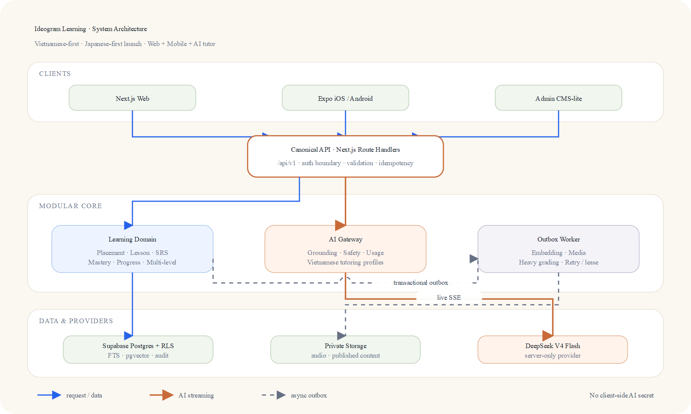
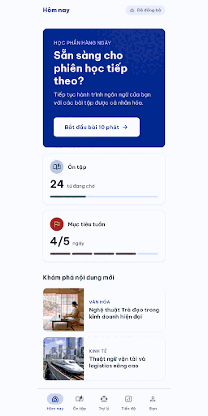

# Ideogram Learning

Ideogram Learning is a Vietnamese-first language learning platform for Japanese-first launch, with planned expansion to Chinese and Korean under separate quality gates. This repository is still at the foundation stage: the web shell, mobile shell, worker stub, shared contracts, public landing page, auth slice, protected learner catalog read route, protected learner shell pages, and two guarded learner write routes exist today; the full interactive learning product flows are not implemented yet.

## Current foundation

- Web: Next.js App Router shell in `apps/web` with public landing, sign-in, callback, and protected learner pages
- Mobile: Expo shell in `apps/mobile` with protected session hydration, native email-link sign-in/callback screens, catalog-backed Today and Lesson read views, and an internal learner shell
- Worker: Node worker stub in `apps/worker`
- Shared packages: `packages/contracts`, `packages/design-tokens`, `packages/config`, `packages/testing`, `packages/auth`, `packages/api-client`, `packages/learning-engine`
- Implemented API routes: `GET /api/v1/health`, `GET /api/v1/learning/catalog`, `POST /api/v1/learning/activities/submit`, `POST /api/v1/learning/reviews/submit`, `POST /api/v1/auth/email-otp`, `GET /auth/callback`, `POST /api/v1/auth/sign-out`
- Web SSR learner pages read the catalog directly; the catalog HTTP route remains the external/mobile surface
- Phase 3 learning persistence: Supabase migrations and private helpers now implement the learning content catalog, placement flow, activity attempts, review engine, and purge receipts. Next.js now exposes the catalog read route, review submission, and a server-evaluated activity submission route for vocabulary acknowledgement and objective listening answers. The remaining learning mutation routes and full interactive learner flows are still pending.
- Validation: run the workspace gates below plus the two named pgTAP suites
  before shipping learner-write changes. Historical review-boundary evidence is
  retained in the engineering journal; it is not deployment evidence.

## Visual references





Design handoff and Stitch exports:

- [Stitch handoff](assets/designs/stitch/README.md)
- [Design guidelines](docs/design-guidelines.md)
- [System architecture doc](docs/system-architecture.md)
- [Media sources and regeneration](docs/media/README.md)

## Product status

- Current product state: internal beta foundation only
- Launch language priority: Japanese first
- Supported exam contracts: JLPT N5-N1, HSK 1-6, TOPIK 1-6, including TOPIK I/II grouping
- Active language-pack state: Japanese is active; Chinese and Korean are seeded as hidden packs until later release gates. The authored Japanese N5 corpus remains review-only until content, pedagogy, and audio gates pass.
- No claim of official exam certification
- Adult-only closed beta is fail-closed pending named product/legal sign-off
- Minors require a separate approved plan before any launch consideration

## Quick start

```bash
corepack enable
corepack pnpm install --frozen-lockfile
pnpm check:env
pnpm dev
```

## Validate and build

```bash
pnpm format:check
pnpm lint
pnpm typecheck
pnpm test
pnpm build
```

## Supabase local workflow

```bash
pnpm supabase:start
pnpm supabase:status
pnpm supabase:stop
```

## Environment

- Copy `.env.example` to a local ignored env file before running secret-backed features.
- `DEEPSEEK_API_KEY` is server-only and must never be placed in `NEXT_PUBLIC_*` or `EXPO_PUBLIC_*`.
- `EXPO_PUBLIC_AUTH_CALLBACK_URL` is optional only in native development, where
  `ideogram-learning://auth/callback` is the fallback. A production mobile
  build must supply one exact claimed HTTPS Universal Link / App Link callback.
- `EXPO_PUBLIC_API_ORIGIN` is public configuration for the mobile read client,
  not a credential. It must be an HTTPS origin in production; development can
  use loopback HTTP. A physical device needs a reachable HTTPS endpoint rather
  than the device's loopback address.
- `APP_ORIGIN` must exactly match the origin opened in the browser; local Supabase
  and the example config use `http://127.0.0.1:3000`.
- `LEARNING_DATABASE_URL` is server-only. Production must use the dedicated
  `ideogram_learning_web_login` login, or a pooler-style suffix for that login
  if the platform requires it, with `sslmode=verify-full` as the only query
  parameter. Configure the Supabase CA in the runtime trust store.
- `LEARNING_DATABASE_POOL_MAX` defaults to `2`, must stay between `1` and `5`,
  and should keep `replicas * pool max` at or below `16` under the login's
  20-connection limit.
- Keep `TRUST_PROXY_IP_HEADERS=false` unless a trusted ingress overwrites
  `x-forwarded-for` and `x-real-ip`.
- `pnpm check:env` scans framework dotenv files without printing their values and
  rejects accidental public AI-key exposure.
- The shared DeepSeek contract is documented in `.env.example` and the related architecture decisions.

## What is not implemented yet

- Other learning mutations, interactive lesson and review UI/offline sync, onboarding, placement, SRS queue UI, AI runtime, progress write flows, and admin workflows
- Activity evaluators beyond vocabulary acknowledgement and objective listening, including speaking and writing assessment
- Production deployment or cloud provisioning
- Hosted production login credential setup for the learning write path; the provisioning SQL exists, but the secret credential and platform wiring remain external
- Any additional endpoint beyond the implemented health, catalog, activity/review submission, and auth lifecycle routes

## Docs

- [Project overview and PDR](docs/project-overview-pdr.md)
- [Code standards](docs/code-standards.md)
- [Codebase summary](docs/codebase-summary.md)
- [System architecture](docs/system-architecture.md)
- [Security and privacy baseline](docs/security-and-privacy-baseline.md)
- [Authentication guide](docs/authentication-guide.md)
- [Privileged operation matrix](docs/privileged-operation-matrix.md)
- [Data lifecycle matrix](docs/data-lifecycle-matrix.md)
- [Account deletion and export saga](docs/account-deletion-and-export-saga.md)
- [API contract](docs/api-contract.md)
- [Mobile support policy](docs/mobile-support-policy.md)
- [External dependency matrix](docs/external-dependency-matrix.md)
- [Execution capacity and load assumptions](docs/execution-capacity-and-load-assumptions.md)
- [Deployment guide](docs/deployment-guide.md)
- [Project roadmap](docs/project-roadmap.md)
- [Content governance](docs/content-governance.md)
- [Learning engine contract](docs/learning-engine-contract.md)
- [AI system and safety](docs/ai-system-and-safety.md)
- [Review and sync contract](docs/review-and-sync-contract.md)
- [Foundation engineering journal](docs/journals/2026-07-29-foundation-safety-rails.md)
