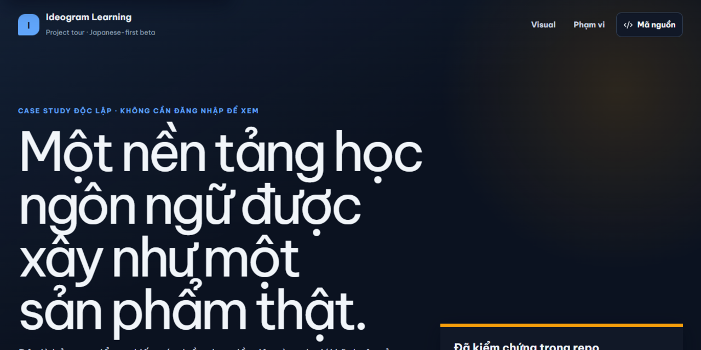
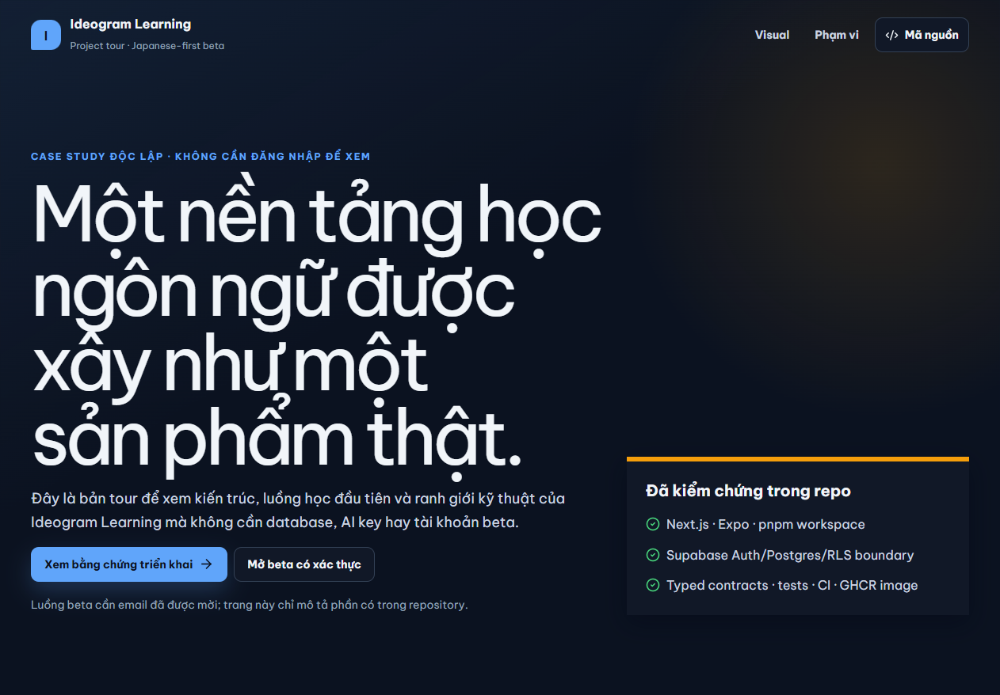
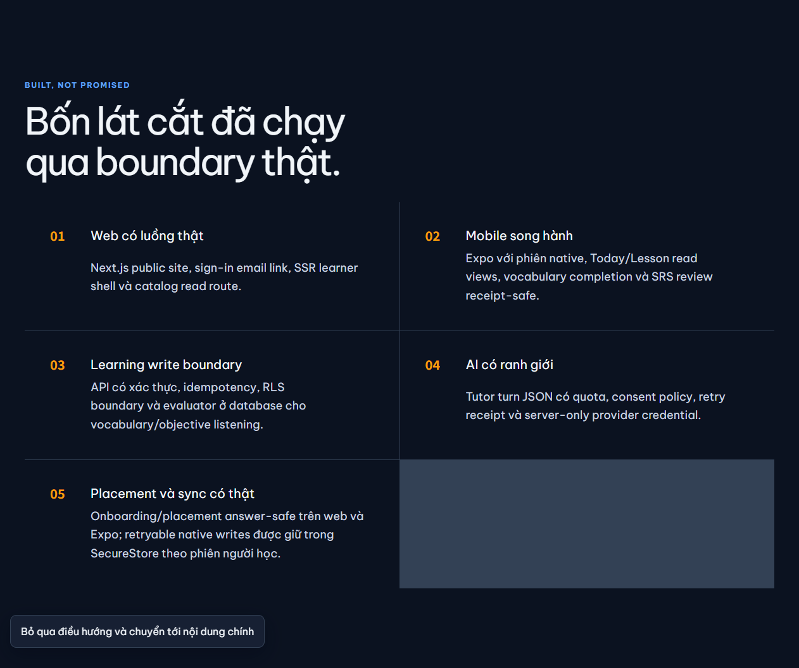
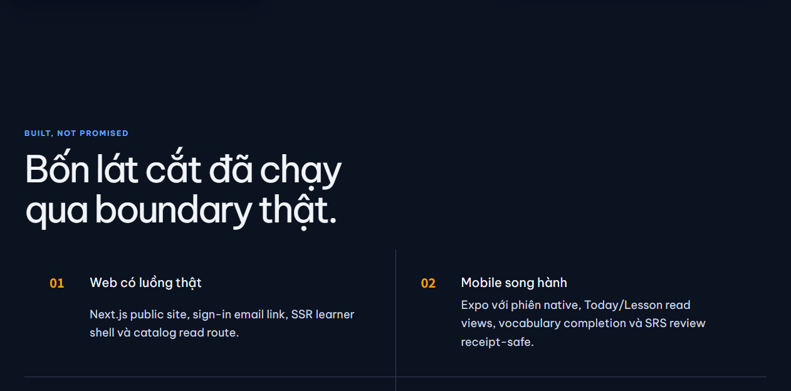
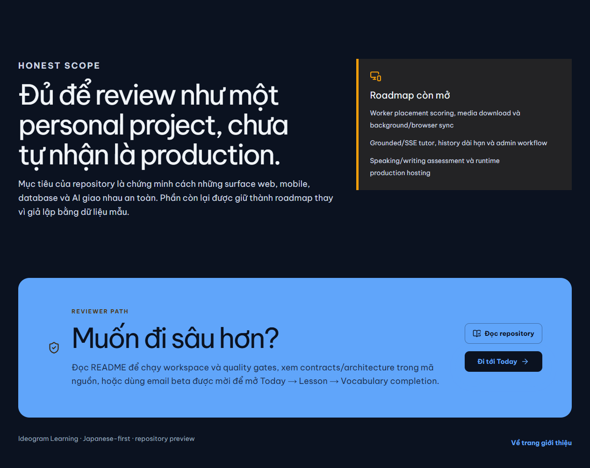
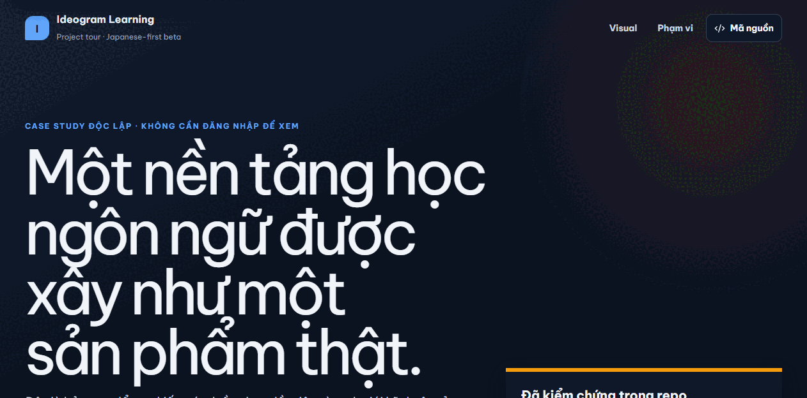
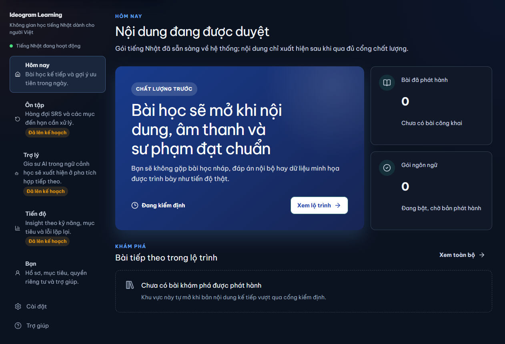
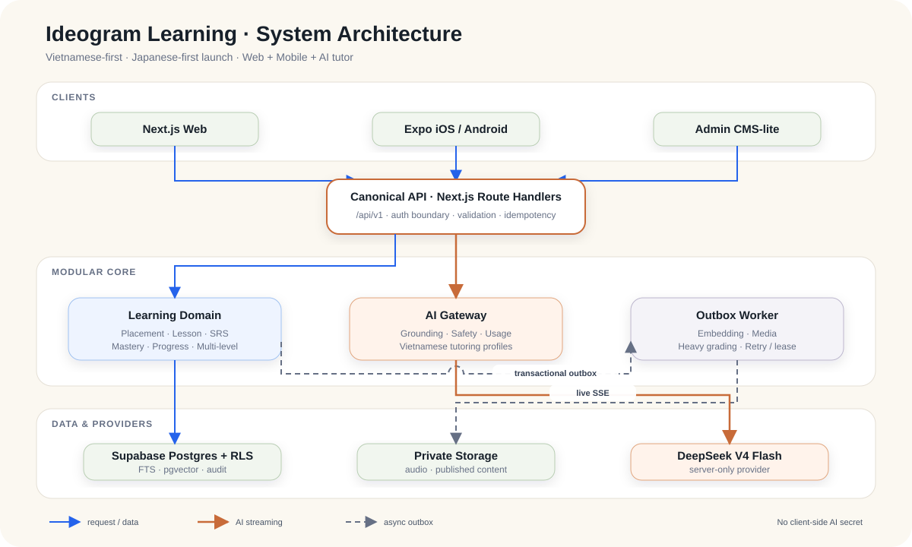
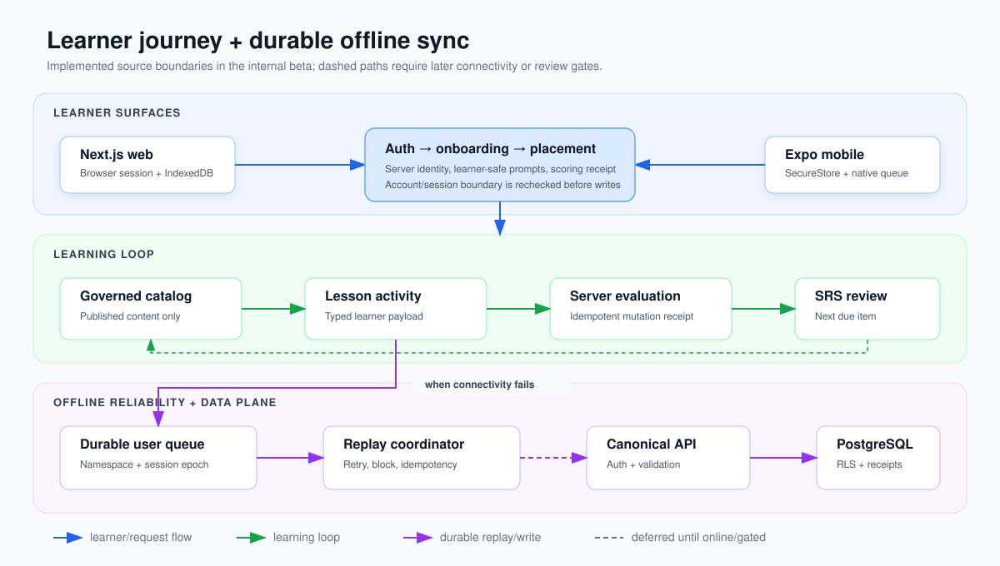

# Ideogram Learning

[](https://github.com/JasonTM17/Ideogram_LearningApp/actions/workflows/ci.yml)
[](LICENSE)
[](package.json)
[](package.json)
[](https://github.com/JasonTM17/Ideogram_LearningApp/pkgs/container/ideogram-learning-app%2Fweb)
[](docs/release/known-limitations.md)



Nền tảng học ngôn ngữ Vietnamese-first, ưu tiên tiếng Nhật khi ra mắt, với
Next.js web, Expo mobile, Supabase/PostgreSQL, worker chấm placement, AI tutor
có giới hạn và đồng bộ offline bền vững. Chinese và Korean đã có contract nhưng
đang được khóa sau release gate riêng.

> **Trạng thái:** source đủ cho repository preview và portfolio review; vẫn là
> pre-beta foundation, chưa phải production deployment. Repo không giả lập bài
> học đã phát hành, audio đã được cấp quyền, native background execution hay
> hosted runtime khi chưa có bằng chứng thật.

[Xem project tour](docs/media/README.md) ·
[Docs index](docs/README.md) ·
[Đọc kiến trúc](docs/system-architecture.md) ·
[Chạy local](#chạy-local) ·
[Release docs](docs/release/README.md) ·
[Xem release checklist](docs/release/release-checklist.md) ·
[Known limitations](docs/release/known-limitations.md)

## Visual tour

Project tour dưới đây được chụp từ route `/showcase` chạy thật và không cần tài
khoản. Bốn ảnh tĩnh là tour chính; `project-tour.gif` chỉ là bản động tùy chọn.

<table>
  <tr>
    <td width="50%">
      <a href="docs/media/project-tour-hero.png"></a>
      <br /><strong>Hero</strong><br />Public preview entry point and visual identity.
    </td>
    <td width="50%">
      <a href="docs/media/project-tour-foundation.png"></a>
      <br /><strong>Foundation</strong><br />Implemented slices and pre-beta foundation scope.
    </td>
  </tr>
  <tr>
    <td width="50%">
      <a href="docs/media/project-tour-evidence.png"></a>
      <br /><strong>Evidence</strong><br />Architecture proof and the boundary between implemented and target state.
    </td>
    <td width="50%">
      <a href="docs/media/project-tour-roadmap.png"></a>
      <br /><strong>Roadmap</strong><br />Still-open browser, device, hosted, and media gates.
    </td>
  </tr>
</table>

<details>
  <summary><strong>Mở project tour dạng GIF (4 frame)</strong></summary>
  <br />
  
</details>

### Bằng chứng web runtime

Ảnh dưới được chụp từ Chromium local sau khi đăng nhập để kiểm chứng IndexedDB,
offline queue và trạng thái Background Sync. Đây không phải bằng chứng hosted
production hay cross-browser certification.

<a href="docs/media/browser-offline-runtime.png"></a>

### Mobile design handoff

Năm màn hình Today, Review, AI tutor, Progress và Profile được chuẩn hóa vào
cùng một khung điện thoại. Đây là Stitch design handoff, không phải native-device
runtime proof.

<p align="center">
  
</p>

### Kiến trúc hệ thống

<a href="docs/media/system-architecture.svg"></a>

[Mở sơ đồ SVG đầy đủ](docs/media/system-architecture.svg) ·
[Đọc giải thích kiến trúc](docs/system-architecture.md)

### Luồng học và đồng bộ offline

<a href="docs/media/learning-and-sync-flow.svg"></a>

Các hình trên là bằng chứng ở phạm vi khác nhau. Xem
[`docs/media/README.md`](docs/media/README.md) để biết nguồn, cách tái tạo và
giới hạn của từng asset.

## Sản phẩm hiện có

| Surface         | Đã triển khai                                                                                                | Giới hạn trung thực                                                       |
| --------------- | ------------------------------------------------------------------------------------------------------------ | ------------------------------------------------------------------------- |
| Web             | Protected learner shell, catalog, review, placement, offline media status, IndexedDB queue, project showcase | Chưa có hosted production/cross-browser certification                     |
| Expo mobile     | Session hydration, onboarding/placement, catalog, review, SecureStore queue, optional BackgroundTask         | Cần proof trên thiết bị thật và native release pipeline                   |
| Learning engine | Japanese-first contracts, activity submission, SRS/review receipts, placement scoring jobs                   | Nội dung authored vẫn review-only; speaking/writing evaluator chưa có     |
| AI tutor        | Authenticated server-only bounded turn, consent/quota ledger, disabled by default                            | Chưa có grounded retrieval, SSE, durable history hay offline tutor queue  |
| Worker          | Enabled-startup logging, optional placement-scoring drain và non-root worker image                           | Container health is process liveness, not database readiness; chưa deploy |
| Offline media   | Manifest/checksum/cache contract và trạng thái unavailable đúng sự thật                                      | Chưa có audio được duyệt quyền hoặc playback proof                        |

## Luồng kiến trúc

```text
Next.js web ─┐
             ├─ canonical API/contracts ─ learning engine ─ Supabase/PostgreSQL
Expo mobile ─┘              │                    │
                            ├─ offline queues    ├─ placement jobs → worker
                            └─ bounded AI route  └─ governed content/media
```

Workspace chính:

```text
apps/web/           Next.js App Router, API handlers, learner UI
apps/mobile/        Expo/React Native learner application
apps/worker/        Node placement-scoring worker
packages/           Contracts, auth, API client, learning engine, sync, UI config
supabase/           Migrations, RLS policies, pgTAP tests
content/            Governed source, manifests, rights ledger, media registry
docs/               Architecture, contracts, runbooks, release evidence
plans/              CK implementation plans and phase reports
```

## Chạy local

Yêu cầu Node `>=24.12.0 <25`, pnpm `>=11.0.9 <12` và Docker khi chạy Supabase.

```bash
corepack enable
corepack pnpm install --frozen-lockfile
pnpm check:env
pnpm dev
```

Trước khi chạy tính năng cần secret, tạo file local bị ignore:

```powershell
Copy-Item .env.example .env.local
```

Trên macOS/Linux dùng `cp .env.example .env.local`. Không đưa output
`pnpm supabase:status` vào log chia sẻ vì có thể chứa credential local.

### Supabase local

```bash
pnpm supabase:start
pnpm supabase:stop
```

## Kiểm tra chất lượng

```bash
pnpm format:check
pnpm lint
pnpm typecheck
pnpm test
pnpm build
pnpm content:lint
```

CI kiểm tra workspace contracts, docs package, governed content, peer/Expo
compatibility, lint, type safety, tests, production build và database
regressions. Sau các gate đó, web/worker images mới được build, smoke-test,
Trivy scan và publish kèm SBOM/provenance. Browser/device E2E, accessibility,
load và coverage threshold vẫn là release gate chưa hoàn tất — xem
[`release-checklist.md`](docs/release/release-checklist.md).

## API surface đã triển khai

- Health và auth session/email OTP/callback/sign-out.
- Learning catalog, offline-media manifest và review queue.
- Placement session create/read/answer/submit.
- Activity và review submission.
- Bounded AI tutor turn.

Chi tiết method, validation và response contract nằm trong
[`docs/api-contract.md`](docs/api-contract.md). Không có API nào ngoài tài liệu
đó được tuyên bố là public contract.

## Content và quyền sử dụng

Japanese N5 pilot hiện có 2 units, 12 lessons, 156 vocabulary/review entries,
40 listening scripts và 25 placement prompts. Nội dung vẫn ở trạng thái review;
audio registry rỗng và quyền redistribution chưa được duyệt.

```bash
pnpm generate:ja-n5-content
pnpm generate:offline-media-manifest
pnpm content:lint
```

MIT áp dụng cho source code và documentation do dự án tạo. Nó không tự động
cấp quyền cho audio, exam material, third-party assets hoặc review-only learning
content. Xem [`NOTICE.md`](NOTICE.md) và
[`content/licenses/manifest.md`](content/licenses/manifest.md).

## Package và release

Web và worker images hiện có trên GHCR:

```bash
docker pull ghcr.io/jasontm17/ideogram-learning-app/web:v0.1.0-alpha.2
docker pull ghcr.io/jasontm17/ideogram-learning-app/web@sha256:a0f5ba12566ee2a08e249d6189782be24075fcad8996a82b91077dc4cb043926
docker pull ghcr.io/jasontm17/ideogram-learning-app/web:latest
docker pull ghcr.io/jasontm17/ideogram-learning-app/worker:v0.1.0-alpha.2
docker pull ghcr.io/jasontm17/ideogram-learning-app/worker@sha256:e481ec304406ad512a400531469784ed7e36f57cacae630a486f1e3192bf4764
docker pull ghcr.io/jasontm17/ideogram-learning-app/worker:latest
```

Workflow mới phát hành tag `sha-*` đầy đủ 40 ký tự; các tag ngắn cũ có thể vẫn
tồn tại trên registry. Tag vẫn có thể được đổi trỏ, nên luôn ưu tiên digest
`sha256:*` bất biến khi kiểm chứng/rollback. Bản
[`v0.1.0-alpha.2`](https://github.com/JasonTM17/Ideogram_LearningApp/releases/tag/v0.1.0-alpha.2)
là repository/container preview, không phải production deployment. Docker Hub
mirror chưa được publish cho release này vì protected credentials không khả
dụng; deterministic source tar.gz, `SHA256SUMS.txt`, social PNG, và
project-tour GIF đã được attach. Native EAS builds vẫn chưa được publish. Xem
[`artifact-matrix.md`](docs/release/artifact-matrix.md).

## Documentation map

| Chủ đề     | Tài liệu                                                                                                                                              |
| ---------- | ----------------------------------------------------------------------------------------------------------------------------------------------------- |
| Tổng quan  | [Project PDR](docs/project-overview-pdr.md) · [Roadmap](docs/project-roadmap.md) · [Codebase summary](docs/codebase-summary.md)                       |
| Kiến trúc  | [System architecture](docs/system-architecture.md) · [ADRs](docs/architecture-decisions) · [Code standards](docs/code-standards.md)                   |
| Learning   | [Learning engine](docs/learning-engine-contract.md) · [Review/sync](docs/review-and-sync-contract.md) · [Offline sync](docs/offline-sync-contract.md) |
| Trust      | [Security/privacy](docs/security-and-privacy-baseline.md) · [Auth](docs/authentication-guide.md) · [Data lifecycle](docs/data-lifecycle-matrix.md)    |
| Operations | [Deployment](docs/deployment-guide.md) · [Runbooks](docs/operations) · [Release evidence](docs/release/README.md)                                     |
| AI/content | [AI safety](docs/ai-system-and-safety.md) · [Content governance](docs/content-governance.md) · [Offline media](docs/offline-media-contract.md)        |

## Roadmap còn mở

- Real-device BackgroundTask và native build/release pipeline.
- Approved audio, checksum registry và browser/device playback proof.
- Hosted web/worker/database, observability, restore và rollback drills.
- Browser/device cross-account E2E, accessibility, and release product gates.
- Grounded/SSE tutor, durable history, broader evaluators và admin workflows.

## Cộng tác và chính sách

[Contributing](.github/CONTRIBUTING.md) ·
[Security](.github/SECURITY.md) ·
[Code of Conduct](.github/CODE_OF_CONDUCT.md) ·
[Changelog](CHANGELOG.md) ·
[License](LICENSE) ·
[Asset notice](NOTICE.md)

Copyright © 2026 Nguyen Tien Son. Project-authored source and documentation are
available under the MIT License, subject to the exclusions described in
`NOTICE.md`.
