# Account Deletion and Export Saga

## Status

The database state machine exists now, but the user-facing enqueue path and the
worker integration are not fully wired yet. The deletion path now also covers
learning-state purge receipts, so account completion cannot happen until the
learning purge helper has finished and left an auditable receipt.
The web learner shell still fails closed for inactive or revoked accounts before
any deletion or export UI is reachable.

## State machine

```mermaid
stateDiagram-v2
  [*] --> requested
  requested --> frozen: server freeze
  requested --> cancelled: invalidate
  requested --> failed: rejection
  frozen --> processing: worker claim
  frozen --> cancelled: export only
  frozen --> failed: claim or purge failure; deletion stays locked
  processing --> completed: purge or export done
  processing --> failed: worker error
  processing --> processing: expired lease reclaim
  completed --> [*]
  failed --> [*]
  cancelled --> [*]
```

## Verified transition rules

- Every request starts in `requested`.
- `transition_version` increments on each accepted state change.
- Only one active request per user is allowed across `requested`, `frozen`, and
  `processing`.
- `frozen_at` is required before a request can move to `processing`.
- `worker_claimed_at` and `lease_expires_at` are required for `processing`.
- A claim, completion, failure, or reclaim must carry a one-use server-issued
  worker-operation guard; a direct table write cannot reuse that permission.
- An expired processing lease can be reclaimed atomically by a new worker with
  the expected request version.
- `completed_at` and `completion_receipt` are required for `completed`.
- `failure_code` is required for `failed`.
- The server rechecks the queued role epoch at freeze; a role change between
  enqueue and freeze invalidates the request.
- A frozen deletion request cannot be cancelled. It changes the profile to
  `pending_deletion`, blocks learner access, and stays locked if the worker
  fails until controlled remediation is implemented.
- `private.purge_learner_learning_data()` deletes learner review, progress,
  placement, enrollment, and event history, then writes one purge receipt per
  request. If the worker retries after the receipt exists, the helper returns
  the recorded counts instead of deleting the same rows twice.
- A deletion request cannot transition to `completed` until a matching
  `private.learning_data_purge_receipts` row exists.

## Operational steps

1. Reauthenticate the subject before accepting a request.
2. Freeze the request so new work stops.
3. Cancel or block dependent jobs.
4. Claim the request in the worker with a lease.
5. Purge or export the subject-owned data.
6. Verify the target stores no longer expose the subject data.
7. Complete the request with a receipt or fail it with a code.

## Notes

- Deletion should win over export when both are in flight for the same subject.
- The current SQL tests prove the state machine, learning purge receipt gate,
  and ownership boundaries, not provider-side deletion or signed URL revocation.
- Do not acknowledge completion until the purge and verification steps are done.

## Open questions

- Controlled retry path for a failed deletion after operator re-verification
- Worker lease duration and retry backoff beyond the bounded reclaim helper
- Exact completion receipt format
- Whether export and deletion should share a common observability event
