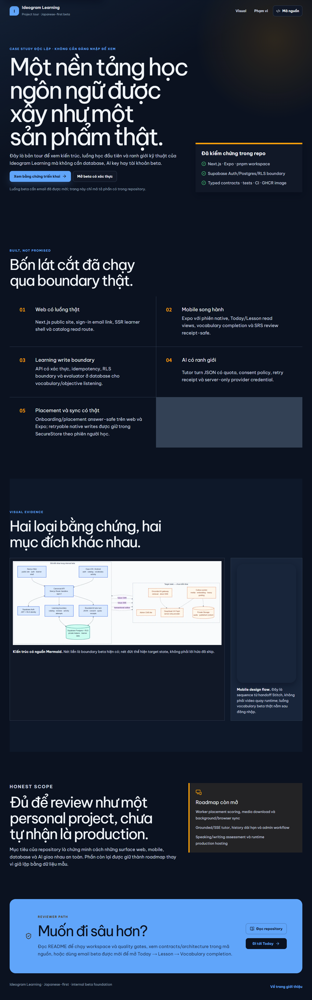

# Media Sources and Regeneration

All repository visuals are derived from source-controlled project material. No
third-party stock artwork is required.

## Architecture

- Semantic source: `docs/diagrams/system-architecture.mmd`
- Renderer theme: `docs/diagrams/mermaid-config.json`
- Local Chrome bridge: `docs/diagrams/puppeteer-config.json`
- Reviewed vector: `docs/media/system-architecture.svg`
- README raster: `docs/media/system-architecture.png`

The learner/offline-sync explainer is a publish-grade SVG with a checked-in
PNG fallback:

- Reviewed vector: `docs/media/learning-and-sync-flow.svg`
- README raster: `docs/media/learning-and-sync-flow.png`

It summarizes implemented source boundaries. It does not claim that native
background execution or production-host replay has been certified.

Regenerate a Mermaid export with the current Mermaid CLI, then review labels and
connector routing before replacing the checked-in SVG:

```bash
pnpm dlx @mermaid-js/mermaid-cli@11.16.0 \
  -p docs/diagrams/puppeteer-config.json \
  -c docs/diagrams/mermaid-config.json \
  -b '#f8fafc' \
  -i docs/diagrams/system-architecture.mmd \
  -o docs/media/system-architecture.svg
```

Create the browser-rendered README raster with the same Mermaid CLI. Rendering
the PNG directly preserves labels that otherwise use SVG `foreignObject` markup:

```bash
pnpm dlx @mermaid-js/mermaid-cli@11.16.0 \
  -p docs/diagrams/puppeteer-config.json \
  -c docs/diagrams/mermaid-config.json \
  -b '#f8fafc' -w 1800 -H 1080 \
  -i docs/diagrams/system-architecture.mmd \
  -o docs/media/system-architecture.png
```

Then sync the two public review assets used by `/showcase`:

```bash
Copy-Item docs/media/system-architecture.png apps/web/public/showcase/system-architecture.png
Copy-Item docs/media/project-tour.gif apps/web/public/showcase/project-tour.gif
```

## Project tour capture

The following files are real, credential-free captures of the locally running
`/showcase` route on 2026-08-03. They show the public project tour only; they
do not prove authenticated learner, browser-background, native-device, or
deployed-worker behavior.

- `showcase-project-tour.png` - full-page capture
- `project-tour-hero.png`, `project-tour-evidence.png`, and
  `project-tour-roadmap.png` - viewport frames
- `project-tour.gif` - optimized sequence of those three frames

Regenerate after starting `pnpm --filter @ideogram/web dev` on a local port
that is not already in use:

```bash
agent-browser open http://127.0.0.1:3001/showcase
agent-browser screenshot docs/media/project-tour-hero.png
# Scroll to the visual-evidence and roadmap sections, then capture the two remaining frames.
magick -delay 120 -loop 0 docs/media/project-tour-hero.png docs/media/project-tour-evidence.png docs/media/project-tour-roadmap.png -layers Optimize docs/media/project-tour.gif
Copy-Item docs/media/project-tour.gif apps/web/public/showcase/project-tour.gif
```




## GitHub social preview

`ideogram-learning-social-preview.png` is a 1280 x 640 crop derived from the
real `/showcase` hero capture. It contains no synthetic product UI or private
learner data.

Regenerate it with ImageMagick:

```bash
magick docs/media/project-tour-hero.png \
  -resize "1280x640^" -gravity center -extent 1280x640 -strip \
  docs/media/ideogram-learning-social-preview.png
```

GitHub requires a repository administrator to upload this file once under
**Settings → General → Social preview**; committing the source alone does not
change the repository card.


## Authenticated browser runtime

`browser-offline-runtime.png` is a credential-free capture from the local
authenticated `/today` runtime used for the IndexedDB and Background Sync
proof. The accompanying request/queue assertions are recorded in
[`docs/release/validation-evidence.md`](../release/validation-evidence.md).
It proves the local Chromium run only, not a deployed production host.


## Mobile learning flow

The GIF uses these Stitch exports in sequence:

1. `assets/designs/stitch/mobile/mobile-today.png`
2. `assets/designs/stitch/mobile/mobile-review.png`
3. `assets/designs/stitch/mobile/mobile-ai-tutor.png`
4. `assets/designs/stitch/mobile/mobile-progress.png`
5. `assets/designs/stitch/mobile/mobile-profile.png`

Regenerate the optimized preview:

```bash
magick -delay 140 -loop 0 \
  assets/designs/stitch/mobile/mobile-today.png \
  assets/designs/stitch/mobile/mobile-review.png \
  assets/designs/stitch/mobile/mobile-ai-tutor.png \
  assets/designs/stitch/mobile/mobile-progress.png \
  assets/designs/stitch/mobile/mobile-profile.png \
  -resize 256x512 docs/media/mobile-learning-flow.gif
```

Verify the result:

```bash
magick identify docs/media/system-architecture.png \
  docs/media/system-architecture.svg \
  docs/media/learning-and-sync-flow.png \
  docs/media/learning-and-sync-flow.svg \
  docs/media/ideogram-learning-social-preview.png \
  docs/media/mobile-learning-flow.gif
```

## Evidence rules

- Use real running-product captures for runtime claims.
- Label local, hosted-browser, native-device, and design-handoff evidence
  separately.
- Do not publish connection-error pages, credentials, personal data, mock
  progress, or placeholder content as product evidence.
- Keep alt text useful and describe the proof boundary next to each visual.
