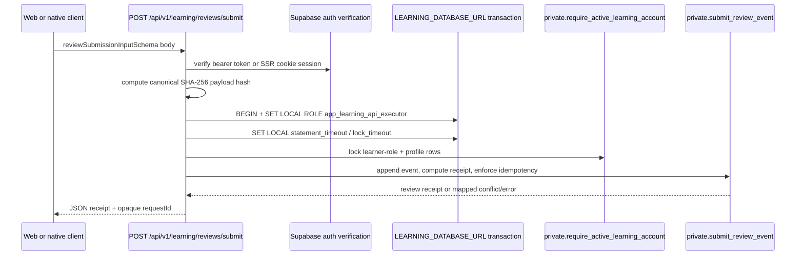
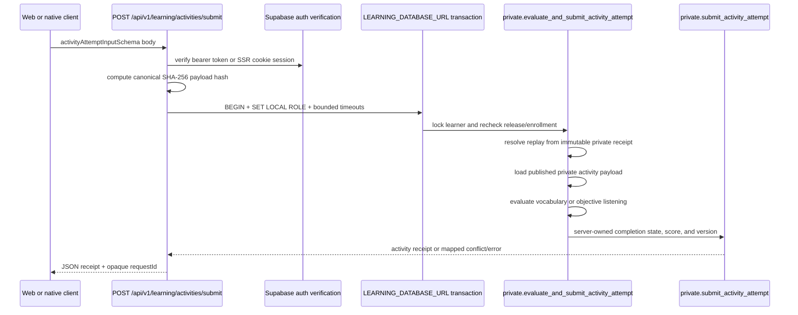
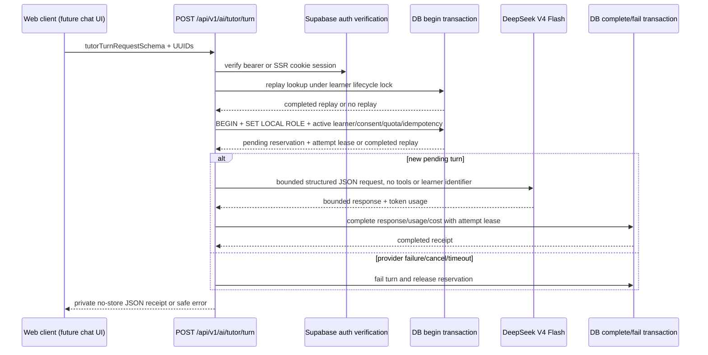
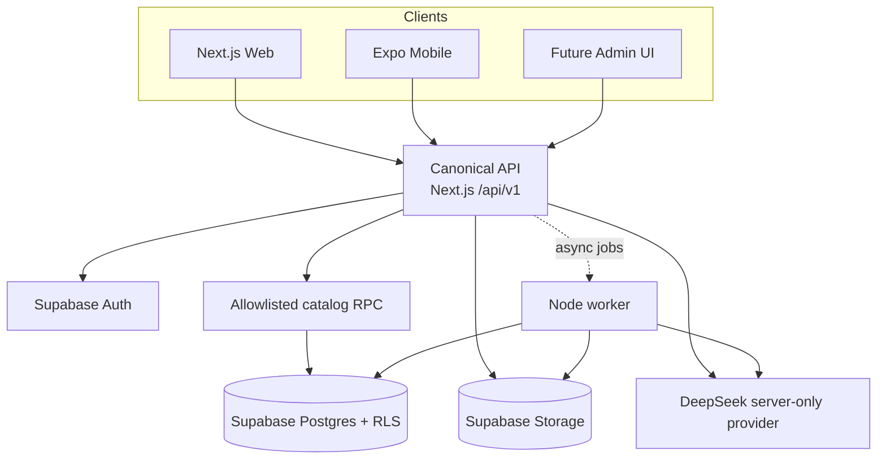

# System Architecture

## Architectural direction

The platform is designed as a modular monolith with three client runtimes and one shared API contract layer:

- Next.js web is the canonical API host under `/api/v1`
- Expo native mobile is a separate runtime
- Node worker handles async or heavy background tasks
- Supabase is the data plane for auth, Postgres, storage, and row-level security
- Shared packages carry only platform-neutral contracts, config helpers, tokens, and tests

## Current state

The implementation is still at the foundation stage for user-facing apps. The implemented HTTP API routes today are `GET /api/v1/health`, `GET /api/v1/learning/catalog`, `POST /api/v1/learning/activities/submit`, `POST /api/v1/learning/reviews/submit`, `POST /api/v1/ai/tutor/turn`, `POST /api/v1/auth/email-otp`, `GET /auth/callback`, and `POST /api/v1/auth/sign-out`. The tutor route is a bounded JSON foundation and remains disabled until explicit AI policy/configuration and consent are present. The web auth slice and protected learner shell pages now exist, and Phase 3 also added the learning persistence layer in Supabase: catalog tables, placement helpers, review helpers, activity attempt helpers, and purge receipts. The live activity, review, and tutor writes use `LEARNING_DATABASE_URL`, a dedicated login that can `SET LOCAL ROLE app_learning_api_executor`, and bounded transaction timeouts. Activity submission evaluates only vocabulary acknowledgement and objective listening responses at the database boundary; speaking and writing remain unavailable until their grading lifecycle exists. External/mobile clients use the catalog HTTP route; web SSR learner pages read the catalog directly after the SSR learner-page gate. Grounded tutor retrieval, direct SSE, native tutor transport, and interactive learner flows remain planned.

## Learner catalog read flow

There are two current read paths:

External/mobile HTTP path:

1. External/mobile clients call `GET /api/v1/learning/catalog`.
2. The Next.js route verifies a Supabase bearer token or SSR cookie session with Supabase Auth verification.
3. The route reads `public.get_learner_catalog_data()` from Supabase.
4. The database returns only active packs and structurally complete published catalog content through a deep allowlist, then enforces the exact projected response budget.
5. The route assembles the shared learner-catalog response contract, independently enforces the serialized response budget, and returns private no-store headers plus an opaque request ID.

Web SSR path:

1. Web SSR learner pages such as `/today`, `/learn`, and `/lessons/[lessonId]` call the SSR learner-page gate.
2. The gate verifies the Supabase user, current active/unrevoked profile, and
   active learner role.
3. Those server components then call `readLearnerCatalog(client)` directly instead of round-tripping through the HTTP catalog route.
4. The same shared learner-catalog response contract boundary applies, but the browser only sees the rendered page output.

## Learning persistence boundary

| Caller / runtime                               | Allowed surface                                | Notes                                                                               |
| ---------------------------------------------- | ---------------------------------------------- | ----------------------------------------------------------------------------------- |
| External/mobile client                         | Next.js catalog route for reads only           | Client code does not read raw learner-catalog tables                                |
| Web SSR learner pages                          | `readLearnerCatalog(client)` after session     | Server components bypass the HTTP route but keep the same auth/read boundary        |
| Authenticated Supabase caller                  | `public.get_learner_catalog_data()`            | Allowlisted aggregate RPC is callable because the `public` schema is exposed        |
| `POST /api/v1/learning/activities/submit`      | Activity evaluator write route                 | Binds learner; DB reads private content and owns completion/score                   |
| `POST /api/v1/learning/reviews/submit`         | Review write route                             | Binds the verified learner, checks the active learner role, and stays no-store      |
| `private.evaluate_and_submit_activity_attempt` | App-executable evaluator                       | Per-learner lock, safe replay, limited current evaluator set                        |
| `private.submit_activity_attempt`              | Internal persistence helper                    | Not executable by `app_learning_api_executor`                                       |
| `private.get_learner_catalog_activities`       | Internal helper for the public catalog RPC     | Definer-owned helper; not granted to authenticated callers                          |
| `app_learning_api_executor`                    | Learner-safe private RPCs                      | Trusted boundary for placement, activity, review, and enrollment writes             |
| `service_role`                                 | Reserved worker-only scoring and purge helpers | The current worker runtime is readiness-only and does not execute these helpers yet |
| `app_security_definer`                         | Narrow definer-owned helpers                   | Owns database helpers and policies; cannot log in or bypass RLS                     |

## Review submission write flow

## Activity submission write flow

## Bounded AI tutor turn flow

The route never holds a database transaction across the provider network call. The
private ledger binds the verified user, conversation, turn UUID, canonical payload
hash, server-generated attempt lease, and structured response; an `AFTER INSERT`
purge trigger removes these rows when the account-deletion worker starts the
existing learning purge. Deletion freeze and AI reservations share lifecycle lock
namespace `7210`. Direct SSE, server-owned lesson retrieval, partial-response
persistence, and reconnect semantics are follow-up work.

## Catalog scale boundary

The aggregate catalog is intentionally capped at 36 releases, 360 units, 600
lessons, 600 activities, 384 KiB of raw activity payloads, a 512 KiB projected
RPC result, and a 512 KiB final HTTP response. Publication also validates
learner-visible payload types/cardinalities and requires each published unit
and lesson to have a child. These are safety limits for the first release, not
the target shape for the complete Japanese, Chinese, and Korean corpus. Before
the corpus outgrows them, catalog discovery becomes a paged index and lesson
activities move to a separate detail route.

## Learning content posture

- Japanese (`ja`) is the active language pack; its authored N5 source corpus is still review-only and has no learner-visible published release.
- Chinese (`zh`) and Korean (`ko`) are seeded as hidden packs and fail closed in RLS and publish checks.
- Published releases are immutable once live; archival closes access without deleting history.
- The catalog read route does not use a service-role secret. It relies on verified request auth plus the allowlisted catalog RPC.

## Identity and privacy boundary

Identity and privacy are modeled as a database-first boundary:

- Supabase Auth proves identity and owns the invite-only email OTP, callback, and local sign-out flow
- The web route client uses `@supabase/ssr` to manage PKCE callback exchange and hardened session cookies
- Native authentication uses a publishable Supabase client with chunked Expo
  SecureStore persistence, installation-bound reinstall cleanup, a PKCE shadow
  registry, explicit AppState refresh control, and a user-bound session epoch.
  Its sign-in/callback UI stores a one-use state/nonce transaction, accepts
  only a code plus exact PKCE flow ID, and gates learner navigation until the
  native session is hydrated. Its catalog read client uses a strict public API
  origin, bearer authentication with cookies omitted, response-contract parsing,
  and a session-identity/view-lifecycle abort scope. Claimed HTTPS
  universal/app-link association and real-device validation remain release work.
- OTP throttling combines provider controls with a bounded in-process hashed
  limiter; proxy-IP buckets are opt-in behind trusted ingress, and production
  horizontal scale still requires a distributed limiter
- Callback redirects suppress referrers, flow IDs are ASCII-only, and
  return-path cookies are size/count bounded
- `public.profiles`, `public.account_roles`, `public.consent_records`, and `public.data_subject_requests` hold the public lifecycle state
- `private.registration_approvals` and `private.security_events` remain private
- `app_security_definer` cannot log in and does not bypass RLS
- The worker is the only runtime intended to hold the service-role secret
- `APP_ORIGIN` must match the exact web origin, and the callback allowlist must include the query-bearing `/auth/callback*` route shape
- Native production builds must use a claimed HTTPS universal/app link; the
  `ideogram-learning://` scheme is a development fallback only, and callback
  payloads must contain no bearer tokens
- The review submission route rechecks the active learner profile and learner
  role inside the same transaction that appends the receipt, so a revoked role
  fails closed even if the bearer session is still valid.
- The tutor route rechecks active learner role, latest AI provider consent,
  language-pack availability, and atomic hourly turn/cost quota in the database
  before calling DeepSeek; every provider completion/failure requires the current
  attempt lease, and its failure path stores only normalized error codes. Exact
  completed replay is checked before new provider configuration/consent gates.
- The learner authorization helper now locks `public.account_roles` before
  `public.profiles` to match the revocation path and avoid deadlock cycles.
- Production-login provisioning fails closed on elevated attributes,
  unapproved memberships, direct ACL grants, and object ownership drift rather
  than silently normalizing an unknown existing role.

The local Supabase config keeps self-service signup disabled and exposes only
the `public` schema through the API configuration. Storage remains available
through the Storage API and is protected with bucket and object policies.

## Architecture diagram

## Boundaries

| Boundary        | Rule                                                         |
| --------------- | ------------------------------------------------------------ |
| Web/mobile      | Do not share DOM or native shells                            |
| Shared packages | Share contracts, tokens, validators, and helpers only        |
| API host        | Keep versioned routes under Next.js                          |
| Worker          | Use for heavy or deferred work only                          |
| Secrets         | Keep AI credentials server-only                              |
| AI package      | `@ideogram/ai` is rejected from mobile/shared/client modules |

## Planned behavior

- Direct SSE is the preferred shape for live AI tutor responses, but the current
  bounded JSON route must gain partial persistence, cancellation, and reconnect
  semantics before that transport is enabled.
- Heavy jobs such as transcription, embeddings, and grading belong in the worker path.
- Search is planned as a hybrid of FTS and pgvector.
- The remaining `/api/v1/learning/*` mutation route handlers beyond activity and review submission remain planned work for Phase 4. The catalog read route, auth lifecycle routes, activity submission, and review submission are already implemented.
- Split the aggregate catalog into paged index and lesson-detail reads before
  increasing the first-release catalog budget.
- Canonical route documentation should continue to live under `docs/api-contract.md`.
- Auth and privacy contracts are documented separately in
  `docs/authentication-guide.md`, `docs/security-and-privacy-baseline.md`, and
  `docs/account-deletion-and-export-saga.md`.

## Related docs

- [Project overview and PDR](./project-overview-pdr.md)
- [Security and privacy baseline](./security-and-privacy-baseline.md)
- [Authentication guide](./authentication-guide.md)
- [Privileged operation matrix](./privileged-operation-matrix.md)
- [Data lifecycle matrix](./data-lifecycle-matrix.md)
- [Account deletion and export saga](./account-deletion-and-export-saga.md)
- [API contract](./api-contract.md)
- [Content governance](./content-governance.md)
- [Learning engine contract](./learning-engine-contract.md)
- [Review and sync contract](./review-and-sync-contract.md)
- [Mobile support policy](./mobile-support-policy.md)
- [External dependency matrix](./external-dependency-matrix.md)
- [Execution capacity and load assumptions](./execution-capacity-and-load-assumptions.md)
- [Adult eligibility decision](./product-decisions/adult-eligibility.md)
