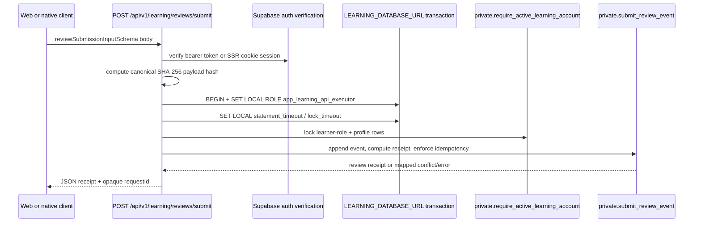
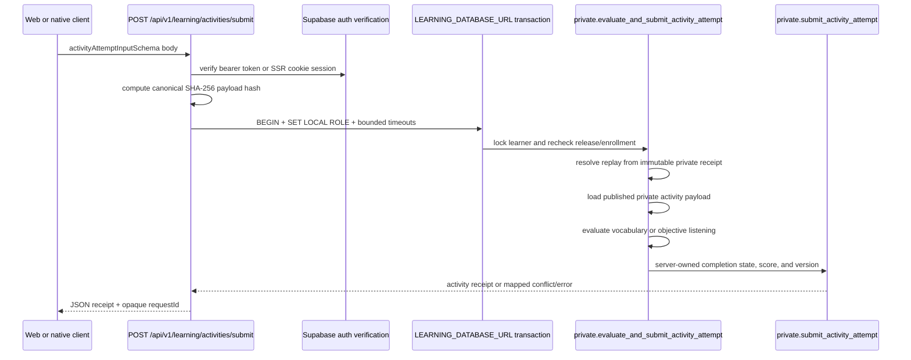
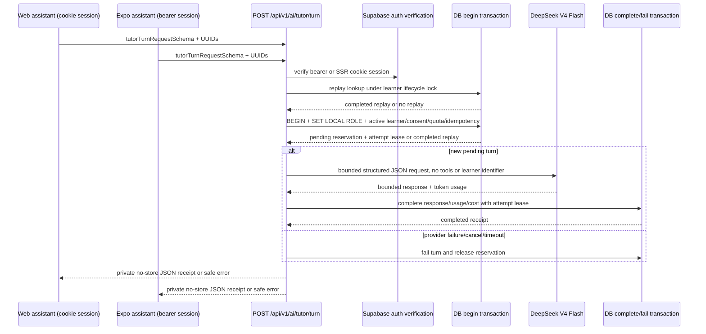

# System Architecture

## Architectural direction

The platform is a modular monolith with three client runtimes and one shared API layer:

- Next.js web is the canonical `/api/v1` host
- Expo native mobile is a separate runtime
- Node worker handles deferred or heavy background work
- Supabase is the data plane for auth, Postgres, storage, and row-level security
- Shared packages carry platform-neutral contracts, helpers, tokens, and tests

## Current state

The source tree now includes the foundation web/mobile experiences plus the first learner-write paths. Implemented behavior includes catalog reads, review reads, placement start/answer/submit, activity/review submission, offline sync, offline media gating, and a bounded tutor turn. Placement scoring, media release, and tutor retrieval are still source-only or pending deployment proof.

### Auth and session identity

- `GET /api/v1/auth/session` returns only `userId` and a derived `sessionEpoch`
- Browser offline-sync code reads that identity and compares the local namespace to the server-derived epoch
- Supabase owns the actual sign-in, callback, and local sign-out flow
- The web route client uses `@supabase/ssr`; the mobile runtime uses a separate secure session store

### Vocabulary acknowledgement slice

- Web activity attempts create the exact public body `{ acknowledged: true }` through the shared activity attempt contract
- The browser activity-operation identity adapter resolves `localStorage` lazily, fails closed when storage or UUID generation is unavailable, and does not promise cross-tab locking
- Native activity screens bind request cancellation to the session lifecycle
- Operation identity is replay metadata only. Authorization, content release access, and evaluator decisions remain server-owned

## Learner catalog read flow

There are two current read paths:

1. External/mobile clients call `GET /api/v1/learning/catalog`.
2. The Next.js route verifies a Supabase bearer token or SSR cookie session.
3. The route reads `public.get_learner_catalog_data()`.
4. The database returns only active packs and structurally complete published catalog content through a deep allowlist.
5. The route assembles the shared learner-catalog response contract, independently enforces the serialized response budget, and returns private no-store headers plus an opaque request ID.

Web SSR learner pages such as `/today`, `/learn`, and `/lessons/[lessonId]` call the SSR learner-page gate, verify the user plus active profile and learner role, then read the catalog directly on the server. The HTTP catalog route remains the external/mobile surface.

## Learning persistence boundary

| Caller / runtime                                              | Allowed surface                                                                       | Notes                                                                            |
| ------------------------------------------------------------- | ------------------------------------------------------------------------------------- | -------------------------------------------------------------------------------- |
| External/mobile client                                        | Next.js catalog, offline-media, review, placement, activity, and review-submit routes | Client code does not read raw catalog or review-item tables                      |
| Web SSR learner pages                                         | `readLearnerCatalog(client)` after session gate                                       | Server components bypass the HTTP route but keep the same auth/read boundary     |
| Authenticated Supabase caller                                 | `public.get_learner_catalog_data()`                                                   | Allowlisted aggregate RPC is callable because the `public` schema is exposed     |
| `POST /api/v1/learning/activities/submit`                     | Activity evaluator write route                                                        | Binds learner; DB reads private content and owns completion/score                |
| `POST /api/v1/learning/reviews/submit`                        | Review write route                                                                    | Binds the verified learner and stays no-store                                    |
| `POST /api/v1/learning/placement/sessions/[sessionId]/submit` | Placement finalize route                                                              | Accepts an exact empty JSON body and writes a server receipt                     |
| `private.evaluate_and_submit_activity_attempt`                | App-executable evaluator                                                              | Per-learner lock, safe replay, limited current evaluator set                     |
| `private.submit_activity_attempt`                             | Internal persistence helper                                                           | Not executable by `app_learning_api_executor`                                    |
| `private.get_learner_catalog_activities`                      | Internal helper for the public catalog RPC                                            | Definer-owned helper; not granted to authenticated callers                       |
| `app_learning_api_executor`                                   | Learner-safe private RPCs                                                             | Trusted boundary for placement, activity, review, and enrollment writes          |
| `service_role`                                                | Worker-only scoring and purge helpers                                                 | Placement scorer source claims leased jobs when enabled; no deployment proof yet |

## Review and activity flows

## Bounded AI tutor turn flow

The route never holds a database transaction across the provider network call. The private ledger binds the verified user, conversation, turn UUID, canonical payload hash, server-generated attempt lease, and structured response. It remains a bounded JSON foundation, not the final SSE shape.

## Offline sync and media

- Web uses IndexedDB plus service-worker Background Sync when supported
- Expo uses SecureStore and an OS-scheduled BackgroundTask when available
- Both queues are user/session namespaced, sequential, receipt-gated, and never score locally
- Browser, real-device, and deployed-worker execution are not yet proven
- Offline media cache/download, removal, and checksum handling are implemented in source, but release approval and runtime proof are still pending

## Learning content posture

- Japanese (`ja`) is the active language pack
- Chinese (`zh`) and Korean (`ko`) are seeded as hidden packs and fail closed in RLS and publish checks
- Published releases are immutable once live
- The catalog read route does not use a service-role secret

## Boundaries

| Boundary        | Rule                                                         |
| --------------- | ------------------------------------------------------------ |
| Web/mobile      | Do not share DOM or native shells                            |
| Shared packages | Share contracts, validators, and helpers only                |
| API host        | Keep versioned routes under Next.js                          |
| Worker          | Use for heavy or deferred work only                          |
| Secrets         | Keep AI credentials server-only                              |
| AI package      | `@ideogram/ai` is rejected from mobile/shared/client modules |

## Planned behavior

- Direct SSE is still follow-up work for the tutor route
- Heavy jobs such as transcription, embeddings, and grading belong in the worker path
- Search is still planned as a hybrid of FTS and pgvector
- Split the aggregate catalog into paged index and lesson-detail reads before increasing the first-release catalog budget
- Canonical route documentation should continue to live under `docs/api-contract.md`

## Related docs

- [Project overview and PDR](./project-overview-pdr.md)
- [Security and privacy baseline](./security-and-privacy-baseline.md)
- [Authentication guide](./authentication-guide.md)
- [Privileged operation matrix](./privileged-operation-matrix.md)
- [Data lifecycle matrix](./data-lifecycle-matrix.md)
- [Account deletion and export saga](./account-deletion-and-export-saga.md)
- [API contract](./api-contract.md)
- [Content governance](./content-governance.md)
- [Learning engine contract](./learning-engine-contract.md)
- [Review and sync contract](./review-and-sync-contract.md)
- [Mobile support policy](./mobile-support-policy.md)
- [External dependency matrix](./external-dependency-matrix.md)
- [Execution capacity and load assumptions](./execution-capacity-and-load-assumptions.md)
- [Adult eligibility decision](./product-decisions/adult-eligibility.md)
