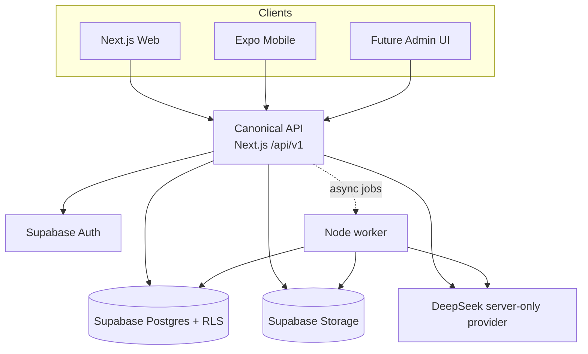

# System Architecture

## Architectural direction

The platform is designed as a modular monolith with three client runtimes and one shared API contract layer:

- Next.js web is the canonical API host under `/api/v1`
- Expo native mobile is a separate runtime
- Node worker handles async or heavy background tasks
- Supabase is the data plane for auth, Postgres, storage, and row-level security
- Shared packages carry only platform-neutral contracts, config helpers, tokens, and tests

## Current state

The implementation is still at the foundation stage for user-facing apps. The only implemented HTTP API route today is `GET /api/v1/health`, but Phase 3 has now added the learning persistence layer in Supabase: catalog tables, placement helpers, review helpers, activity attempt helpers, and purge receipts. Those learning operations are database private helpers, not Next.js route handlers yet.

## Learning persistence boundary

| Caller / runtime            | Allowed surface                       | Notes                                                                               |
| --------------------------- | ------------------------------------- | ----------------------------------------------------------------------------------- |
| Web / mobile client         | None directly                         | No direct learner writes to Postgres from the client runtime                        |
| `app_learning_api_executor` | Learner-safe private RPCs             | Trusted application boundary for placement, activity, review, and enrollment writes |
| `service_role`              | Worker-only scoring and purge helpers | Used for placement scoring and privacy purge; not for learner write paths           |
| `app_security_definer`      | Narrow definer-owned helpers          | Owns the database helpers and policies; cannot log in or bypass RLS                 |

## Learning content posture

- Japanese (`ja`) is the active language pack; its authored N5 source corpus is still review-only and has no learner-visible published release.
- Chinese (`zh`) and Korean (`ko`) are seeded as hidden packs and fail closed in RLS and publish checks.
- Published releases are immutable once live; archival closes access without deleting history.

## Identity and privacy boundary

Identity and privacy are modeled as a database-first boundary:

- Supabase Auth proves identity
- `public.profiles`, `public.account_roles`, `public.consent_records`, and `public.data_subject_requests` hold the public lifecycle state
- `private.registration_approvals` and `private.security_events` remain private
- `app_security_definer` cannot log in and does not bypass RLS
- The worker is the only runtime intended to hold the service-role secret

The local Supabase config keeps self-service signup disabled and exposes only
the `public` schema through the API configuration. Storage remains available
through the Storage API and is protected with bucket and object policies.

## Architecture diagram

## Boundaries

| Boundary        | Rule                                                  |
| --------------- | ----------------------------------------------------- |
| Web/mobile      | Do not share DOM or native shells                     |
| Shared packages | Share contracts, tokens, validators, and helpers only |
| API host        | Keep versioned routes under Next.js                   |
| Worker          | Use for heavy or deferred work only                   |
| Secrets         | Keep AI credentials server-only                       |

## Planned behavior

- Direct SSE is the preferred shape for live AI tutor responses.
- Heavy jobs such as transcription, embeddings, and grading belong in the worker path.
- Search is planned as a hybrid of FTS and pgvector.
- `/api/v1/learning/*` route handlers remain planned work for Phase 4; the learning rules documented here are the database contract they will call.
- Canonical route documentation should continue to live under `docs/api-contract.md`.
- Auth and privacy contracts are documented separately in
  `docs/authentication-guide.md`, `docs/security-and-privacy-baseline.md`, and
  `docs/account-deletion-and-export-saga.md`.

## Related docs

- [Project overview and PDR](./project-overview-pdr.md)
- [Security and privacy baseline](./security-and-privacy-baseline.md)
- [Authentication guide](./authentication-guide.md)
- [Privileged operation matrix](./privileged-operation-matrix.md)
- [Data lifecycle matrix](./data-lifecycle-matrix.md)
- [Account deletion and export saga](./account-deletion-and-export-saga.md)
- [API contract](./api-contract.md)
- [Content governance](./content-governance.md)
- [Learning engine contract](./learning-engine-contract.md)
- [Review and sync contract](./review-and-sync-contract.md)
- [Mobile support policy](./mobile-support-policy.md)
- [External dependency matrix](./external-dependency-matrix.md)
- [Execution capacity and load assumptions](./execution-capacity-and-load-assumptions.md)
- [Adult eligibility decision](./product-decisions/adult-eligibility.md)
