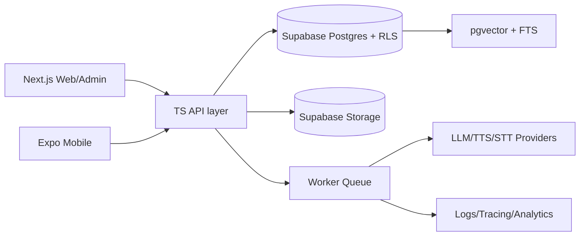

# Platform Architecture Research

## Tóm tắt
- Khuyến nghị chính: monorepo TypeScript với `Next.js` (web/admin) + `Expo/React Native` (mobile), backend `Supabase-first` (Auth/Postgres/Storage/RLS/pgvector/Edge Functions), thêm 1 worker TS nhỏ cho job nặng. Đây là phương án MVP-pragmatic nhất, code-sharing tốt, và hợp với pipeline thiết kế sang code của Stitch [Next.js App Router](https://nextjs.org/docs), [Expo monorepos](https://docs.expo.dev/guides/monorepos/), [Supabase Auth](https://supabase.com/docs/guides/auth), [Supabase AI & Vectors](https://supabase.com/docs/guides/ai), [Stitch](https://stitch.withgoogle.com/) .
- Không khuyến nghị `Flutter` làm stack chính cho MVP nếu mục tiêu là chia sẻ UI/logic với web và tận dụng Stitch; Flutter hợp hơn khi team mobile-native rất mạnh hoặc cần hiệu ứng native sâu. `PWA-only` rẻ nhất nhưng yếu về offline, push, app-store presence, và media/audio.
- Cốt lõi kiến trúc nên là modular monolith, chưa microservices. Chỉ tách worker khi queue/audio/AI vượt ngưỡng vận hành.

## Ma Trận Quyết Định
| Phương án | Fit MVP | Chia sẻ code | Tốc độ ra sản phẩm | Native mobile | Ops | Điểm |
|---|---:|---:|---:|---:|---:|---:|
| A. Next.js + Expo + Supabase + worker nhỏ | 5 | 5 | 4 | 4 | 4 | 22 |
| B. Next.js + Flutter + backend riêng | 3 | 2 | 3 | 5 | 3 | 16 |
| C. Web-first/PWA, mobile sau | 4 | 1 | 5 | 2 | 5 | 17 |

## So Sánh
### A. Next.js + Expo
- Mạnh nhất về code-sharing thực tế: chia sẻ types, validation, API client, auth helpers, content models, design tokens.
- Expo docs xác nhận 1 project JS/TS có thể chạy native trên Android/iOS/web và hỗ trợ monorepo/EAS Build [Expo home](https://docs.expo.dev/), [Expo monorepos](https://docs.expo.dev/guides/monorepos/), [Expo monorepo build](https://docs.expo.dev/build-reference/build-with-monorepos/).
- Next.js App Router hỗ trợ React Server Components và monorepo-friendly TS flow [Next.js docs](https://nextjs.org/docs), [transpilePackages](https://nextjs.org/docs/app/api-reference/config/next-config-js/transpilePackages).
- Rủi ro: cần discipline boundary, không share UI component bừa giữa web và native.

### B. Next.js + Flutter
- Flutter add-to-app hỗ trợ Android/iOS/web, nhưng model code-sharing giữa web React và mobile Dart kém tự nhiên [Flutter add-to-app](https://docs.flutter.dev/add-to-app).
- Tốt cho trải nghiệm native và animation, nhưng quy đổi design system từ Stitch/HTML/Tailwind sang Flutter sẽ tốn thêm lớp chuyển dịch. Đây là inference từ hệ sinh thái, không phải claim của Flutter hay Stitch.
- Rủi ro: 2 UI stacks, 2 skill sets, 2 test/tooling pipelines.

### C. Web-first/PWA
- Rẻ và nhanh nhất để ra mắt. Nhưng nếu app cần học offline, push notification, camera/audio, app-store distribution, PWA sẽ đụng trần sớm.
- Hợp nếu muốn validate nội dung/market trước, không hợp nếu mobile là core channel ngay từ đầu.

## Backend
### Ưu tiên 1: Supabase-first
- Supabase cung cấp Auth, Postgres, Storage, RLS và AI/vector tooling cùng một data plane [Auth](https://supabase.com/docs/guides/auth), [RLS](https://supabase.com/docs/guides/database/postgres/row-level-security), [Storage RLS](https://supabase.com/docs/guides/storage/security/access-control), [pgvector](https://supabase.com/docs/guides/database/extensions/pgvector).
- Fit tốt cho MVP vì học liệu, tiến độ, lịch sử luyện tập, transcript, bookmark, quiz, embeddings đều sống trong Postgres.
- Security tốt hơn nếu ép mọi client read/write qua RLS và private buckets.

### Ưu tiên 2: NestJS worker/service nhỏ
- Dùng cho job nặng: transcription, TTS, embedding refresh, grading async, import/export.
- NestJS hợp làm service modular vì DI/modules rõ ràng và queue support chính thức [Nest modules](https://docs.nestjs.com/modules), [Nest providers](https://docs.nestjs.com/providers), [Nest queues](https://docs.nestjs.com/techniques/queues).
- Không nên dùng NestJS full-stack CRUD từ ngày 1 nếu Supabase đã xử lý được phần lớn auth/data access.

## Kiến Trúc Đề Xuất

### Monorepo
- `apps/web` - Next.js user-facing web
- `apps/mobile` - Expo app
- `apps/admin` - Next.js admin/CMS-lite
- `packages/ui` - design tokens, icons, base primitives
- `packages/domain` - schema, validators, business types
- `packages/api-client` - typed server/client access
- `packages/ai` - provider adapter, prompt templates, streaming types
- `packages/media` - audio/transcript helpers
- `services/worker` - background jobs only

### Boundary rules
- Share: tokens, types, validation, i18n, API client, feature flags, analytics events.
- Do not share blindly: page components, navigation shells, platform-specific media UI.
- If a component needs DOM-only or native-only APIs, keep it in app package.

## Data Flow
1. Auth via Supabase Auth JWT.
2. App calls TS API/client helpers.
3. Reads/writes go to Postgres with RLS; files go to private Storage buckets.
4. Search uses FTS + pgvector hybrid search.
5. AI/speech requests enqueue jobs; worker streams provider events back to app when needed.
6. Analytics/observability emit from app + worker, not from DB triggers except lightweight audit.

## Deployment & Tiers
- Local: pnpm workspace + Supabase local/dev + mocked AI/provider envs.
- Preview: Vercel preview for web/admin, EAS internal builds for mobile, separate Supabase staging.
- Prod: Vercel web/admin, EAS production releases, Supabase prod, 1 worker service on Cloud Run/Fly.io/Render when queues exceed Supabase edge limits.
- Start with no Redis. Add Redis/BullMQ only when queue latency/throughput proves it.

## Scaling Triggers
- API p95 > 300ms on common reads: add caching/read model/materialized views.
- Queue backlog > 5 min or > 100 pending audio/AI jobs: split worker horizontally.
- Offline sync conflicts > 1% sessions: add local SQLite sync layer later.
- Admin editorial workflows grow beyond CRUD: introduce headless CMS only then.

## Rủi Ro / Giảm Thiểu
- RLS phức tạp: viết policy chuẩn, test policy như code, private bucket mặc định.
- Audio/voice privacy: consent, retention window, delete/export path.
- Vendor lock-in: keep AI/provider adapter narrow; use provider-neutral streaming interface.
- Cross-platform drift: keep shared packages limited to domain/tokens, not full screens.

## ADR Candidates
- ADR-01: `Next.js + Expo` là stack client chính.
- ADR-02: `Supabase-first` cho auth/data/storage/search.
- ADR-03: 1 worker service cho job nặng, không microservices.
- ADR-04: Share tokens/types, không share full UI runtime.
- ADR-05: Search strategy = FTS + pgvector hybrid.

## Kết Luận
- Chọn A. Đây là phương án cân bằng nhất giữa tốc độ MVP, khả năng ship mobile thật, chi phí, và khả năng mở rộng vừa đủ.
- B chỉ chọn khi team mobile-native mạnh và chấp nhận 2 UI stacks.
- C chỉ nên dùng nếu mục tiêu ngắn hạn là validation thị trường web trước, chưa cần app stores.

## Nguồn Chính
- Next.js docs: https://nextjs.org/docs
- Next.js transpilePackages: https://nextjs.org/docs/app/api-reference/config/next-config-js/transpilePackages
- Expo docs: https://docs.expo.dev/
- Expo monorepos: https://docs.expo.dev/guides/monorepos/
- Expo EAS monorepo: https://docs.expo.dev/build-reference/build-with-monorepos/
- Flutter add-to-app: https://docs.flutter.dev/add-to-app
- Supabase Auth: https://supabase.com/docs/guides/auth
- Supabase RLS: https://supabase.com/docs/guides/database/postgres/row-level-security
- Supabase Storage access control: https://supabase.com/docs/guides/storage/security/access-control
- Supabase pgvector: https://supabase.com/docs/guides/database/extensions/pgvector
- NestJS modules/providers/queues: https://docs.nestjs.com/modules , https://docs.nestjs.com/providers , https://docs.nestjs.com/techniques/queues
- Anthropic streaming SSE: https://docs.anthropic.com/en/api/messages-streaming
- Stitch home and DESIGN.md: https://stitch.withgoogle.com/ , https://stitch.withgoogle.com/docs/design-md/overview/
